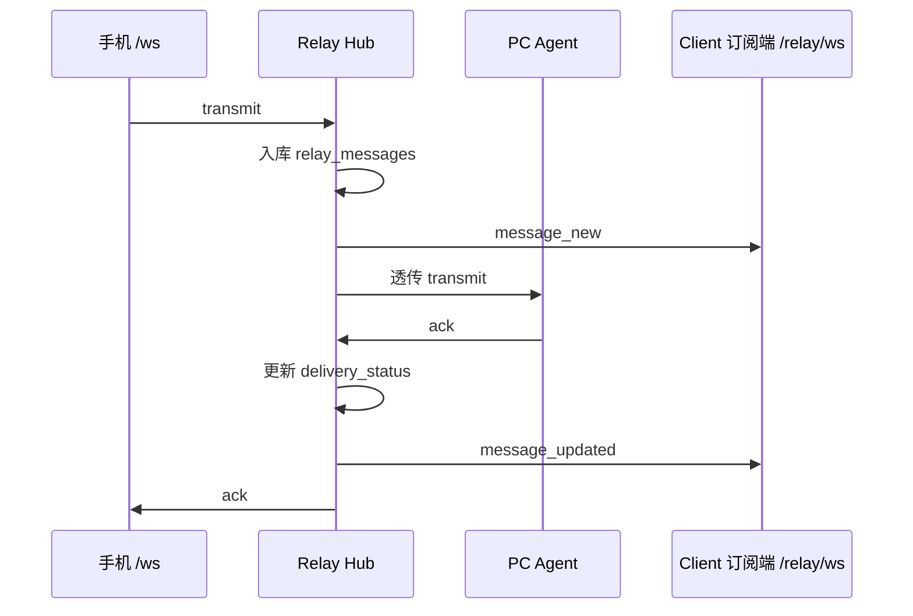

# 传声筒 · 中继消息 Client 订阅对接文档

**版本**：1.0.0  
**状态**：已实现  
**关联**：[relay-api.md](./relay-api.md)（完整 Relay Hub API）

---

## 1. 定位说明

云端中继（Relay Hub）有三种 WebSocket 角色：

| 角色 | 端点 | 职责 |
|------|------|------|
| **手机 / 发送端** | `/ws?pair={pair_token}` | 发送 `transmit`，接收 ack |
| **PC Agent** | `/agent?pair_id=…&agent_token=…` | 接收透传，回 ack |
| **Client 订阅端** | `/relay/ws?token={jwt}` | **只读订阅**，实时接收本账号下中继消息变更 |

本文档面向 **Client 订阅端**：任何需要「实时看到传声筒中继消息」的客户端，例如：

- Web「工匠」页
- 桌面通知客户端
- 自建 Dashboard / 监控面板
- 第三方集成服务（持有用户 JWT 的后端进程）

Client 订阅端 **不参与消息转发**，只接收服务端推送的事件。

---

## 2. 架构关系



---

## 3. 前置条件

### 3.1 获取 JWT

Client 订阅使用与 REST API 相同的 JWT，需先登录：

```http
POST /auth/jwt/login
Content-Type: application/x-www-form-urlencoded

username=user@example.com&password=your_password
```

响应：

```json
{
  "access_token": "eyJhbGciOiJIUzI1NiIsInR5cCI6IkpXVCJ9...",
  "token_type": "bearer"
}
```

后续连接 WebSocket 时使用 `access_token`。

> JWT 过期后连接会被拒绝（关闭码 `4001`），需重新登录获取新 token 并重连。

### 3.2 服务地址

| 环境 | HTTP Base | WebSocket 订阅地址 |
|------|-----------|-------------------|
| 本地开发 | `http://localhost:8600` | `ws://localhost:8600/relay/ws` |
| Dev Container | `http://localhost:8601` | `ws://localhost:8601/relay/ws` |
| 生产（暂 ws） | `http://your-host:8600` | `ws://your-host:8600/relay/ws` |
| 生产（WSS 就绪后） | `https://your-host` | `wss://your-host/relay/ws` |

将 HTTP Base 的 `http` 替换为 `ws`（或 `https` → `wss`），路径固定为 `/relay/ws`。

---

## 4. 建立连接

### 4.1 连接 URL

```
ws://{host}:{port}/relay/ws?token={access_token}
```

- `token`：Query 参数，值为 JWT 字符串（需 `encodeURIComponent` 编码）
- 鉴权在握手阶段完成；**不支持** Header 传 `Authorization`（标准 WebSocket 浏览器 API 限制）

### 4.2 连接成功

握手通过后服务端 `accept`，此后进入 **被动接收** 模式：

- 服务端 **不会** 发送 `connected` 欢迎帧
- Client **无需** 发送任何消息即可保持连接
- 有消息入库或状态变更时，服务端主动推送 JSON 文本帧

### 4.3 连接失败

| 关闭码 | 含义 | 处理建议 |
|--------|------|----------|
| `4001` | JWT 无效、过期或用户未激活 | 重新登录，用新 token 重连 |
| 握手失败 / 404 | 地址错误或 Relay 服务未启动 | 检查 host、port、路径 |
| 连接被重置 | 网络中断、容器重启 | 指数退避重连 |

---

## 5. 事件协议

所有推送均为 **UTF-8 JSON 文本帧**，顶层结构：

```json
{
  "type": "<event_type>",
  "message": { /* RelayMessage 对象，见第 6 节 */ }
}
```

### 5.1 事件类型

| type | 触发时机 | 说明 |
|------|----------|------|
| `message_new` | 手机 `transmit` 入库后 | 新消息，含初始 `delivery_status` |
| `message_updated` | 消息投递状态变更后 | 同一条消息的更新版本 |

### 5.2 `message_new` 触发场景

- 手机发送 `transmit`，PC Agent **在线**：入库，`delivery_status = "pending"`
- 手机发送 `transmit`，PC Agent **离线**：入库，`delivery_status = "pc_offline"`
- 转发 Agent 失败：先 `pending` 推送，随后可能再推 `message_updated`

### 5.3 `message_updated` 触发场景

| 场景 | 变更后 `delivery_status` | `ack_ok` |
|------|--------------------------|----------|
| PC Agent 确认成功 | `delivered` | `true` |
| PC Agent 确认失败 | `failed` | `false` |
| 转发时 Agent 掉线 | `pc_offline` | `false` |

> Client 应以 `message.id` 做 upsert：若列表中已存在则更新，否则插入。

---

## 6. 消息对象（RelayMessageRead）

`message` 字段结构与 REST `GET /relay/messages` 返回的单条记录一致：

```json
{
  "id": "550e8400-e29b-41d4-a716-446655440000",
  "pair_id": "pair_abc123",
  "text": "用户语音转写或输入的文本",
  "mode": "type",
  "after_key": "enter",
  "smart_mode": false,
  "smart_action": null,
  "delivery_status": "pending",
  "ack_ok": null,
  "ack_error": null,
  "client_ip": "192.168.1.10",
  "created_at": "2026-07-04T14:58:00.000000Z"
}
```

### 6.1 字段说明

| 字段 | 类型 | 说明 |
|------|------|------|
| `id` | UUID 字符串 | 消息唯一 ID |
| `pair_id` | string | 所属配对 ID |
| `text` | string | 消息正文 |
| `mode` | string \| null | 输入模式，如 `type` |
| `after_key` | string \| null | 输入后按键，如 `enter` |
| `smart_mode` | boolean | 是否智能模式 |
| `smart_action` | string \| null | 智能动作 |
| `delivery_status` | string | 见下表 |
| `ack_ok` | boolean \| null | Agent ack 结果；未 ack 前为 `null` |
| `ack_error` | string \| null | 失败原因，如 `"PC 离线"` |
| `client_ip` | string \| null | 发送端 IP |
| `created_at` | ISO 8601 | 入库时间（UTC） |

### 6.2 `delivery_status` 枚举

| 值 | 含义 |
|----|------|
| `pending` | 已入库，等待 PC Agent 处理 |
| `delivered` | Agent 已确认收到 |
| `failed` | Agent 明确拒绝或处理失败 |
| `pc_offline` | 发送时或转发时 PC 不在线 |

---

## 7. Client 实现要点

### 7.1 推荐行为

1. **单用户单连接**：每个 JWT 对应一个登录用户，只收到该用户名下所有 pair 的消息
2. **幂等合并**：按 `message.id` 去重，避免重连后重复展示
3. **断线重连**：连接断开后延迟重连（建议 3–5 秒，可指数退避）
4. **Token 刷新**：收到 `4001` 或 REST 401 时刷新 JWT 再重连
5. **初始全量 + 增量**：页面打开时先 `GET /relay/messages` 拉历史，WS 只负责增量

### 7.2 不需要做的事

- 不需要发送 `transmit`
- 不需要发送心跳（服务端通过 `receive` 循环维持连接；可选发任意文本帧，但无协议定义）
- 不需要 pair_token / agent_token

### 7.3 与 REST 的关系

| 能力 | REST | Client WS |
|------|------|-----------|
| 历史消息列表 | `GET /relay/messages` | — |
| 消息详情 | `GET /relay/messages/{id}` | 事件中已含完整对象 |
| 软删除 | `DELETE /relay/messages/{id}` | 删除 **不会** 推送事件 |
| 实时新增/更新 | 需轮询 | `message_new` / `message_updated` |

---

## 8. 接入示例

### 8.1 浏览器（TypeScript）

```typescript
type RelayMessage = {
  id: string;
  pair_id: string;
  text: string;
  delivery_status: string;
  ack_ok: boolean | null;
  ack_error: string | null;
  created_at: string;
  // ... 其余字段见第 6 节
};

function connectRelayEvents(
  wsBase: string, // 如 "ws://localhost:8601/relay/ws"
  token: string,
  handlers: {
    onNew: (msg: RelayMessage) => void;
    onUpdated: (msg: RelayMessage) => void;
  },
) {
  const url = `${wsBase}?token=${encodeURIComponent(token)}`;
  const ws = new WebSocket(url);

  ws.onmessage = (event) => {
    const data = JSON.parse(event.data);
    if (data.type === "message_new") handlers.onNew(data.message);
    if (data.type === "message_updated") handlers.onUpdated(data.message);
  };

  ws.onclose = (event) => {
    if (event.code === 4001) {
      console.error("JWT 无效或过期，请重新登录");
      return;
    }
    setTimeout(() => connectRelayEvents(wsBase, token, handlers), 3000);
  };

  return () => ws.close();
}
```

本仓库参考实现：`apps/frontend/components/craftsman/use-relay-events.ts`

### 8.2 Node.js（ws 库）

```javascript
import WebSocket from "ws";

const token = process.env.RELAY_JWT;
const url = `ws://localhost:8600/relay/ws?token=${encodeURIComponent(token)}`;

const ws = new WebSocket(url);

ws.on("message", (raw) => {
  const { type, message } = JSON.parse(raw.toString());
  if (type === "message_new") {
    console.log("[新消息]", message.text);
  }
  if (type === "message_updated") {
    console.log("[更新]", message.id, message.delivery_status);
  }
});

ws.on("close", (code) => {
  console.log("连接关闭", code);
});
```

### 8.3 Python（websockets）

```python
import asyncio
import json
import urllib.parse

import websockets

TOKEN = "eyJ..."
URL = f"ws://localhost:8600/relay/ws?token={urllib.parse.quote(TOKEN)}"


async def subscribe():
    async with websockets.connect(URL) as ws:
        async for raw in ws:
            event = json.loads(raw)
            if event["type"] == "message_new":
                print("新消息:", event["message"]["text"])
            elif event["type"] == "message_updated":
                msg = event["message"]
                print("更新:", msg["id"], msg["delivery_status"])


asyncio.run(subscribe())
```

### 8.4 命令行快速验证

```bash
# 1. 登录拿 token
TOKEN=$(curl -s -X POST http://localhost:8600/auth/jwt/login \
  -d "username=user@example.com&password=secret" \
  | jq -r .access_token)

# 2. 订阅（另开终端，手机发 transmit 后此处应收到 JSON）
npx -y wscat -c "ws://localhost:8600/relay/ws?token=${TOKEN}"
```

---

## 9. 常见问题

**Q：能订阅指定 pair_id 吗？**  
A：当前版本按 **用户维度** 推送该账号下所有配对的消息，不支持按 pair 过滤。Client 端可在收到事件后自行按 `message.pair_id` 过滤。

**Q：多 Tab / 多 Client 同时连会怎样？**  
A：同一用户的多个连接都会收到相同事件，互不影响。

**Q：JWT 放在 URL 里安全吗？**  
A：Query 参数可能出现在访问日志中。浏览器场景可接受；服务端常驻进程建议使用环境变量注入，生产环境优先 `wss://`。

**Q：Vercel 上能连吗？**  
A：WebSocket 长连接需 **容器常驻** 部署后端（Docker / Dokploy），不能走 Vercel Serverless。详见 [relay-api.md §7](./relay-api.md#7-生产部署ws-直连暂不含-wss)。

**Q：删除消息后 WS 会通知吗？**  
A：不会。删除仅通过 REST `DELETE /relay/messages/{id}`，Client 需自行从本地列表移除或重新拉取列表。

---

## 10. 变更记录

| 日期 | 版本 | 说明 |
|------|------|------|
| 2026-07-04 | 1.0.0 | 初版：Client 订阅端 `/relay/ws` 对接说明 |
