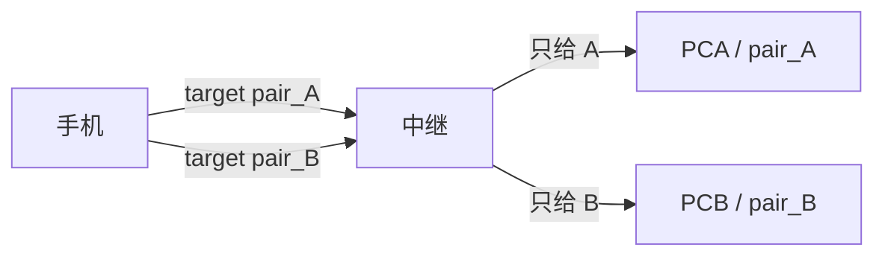

# 多配对路由：一台手机 → 中继 → 多台 PC

逻辑就一句话：**`pair_id` 是目的地址。**  
手机指定 A，中继只送到 PCA；指定 B，只送到 PCB。不会广播到所有 PC。

工匠页 / JWT 订阅是旁路「看消息」，不是 PC 投递通道。

---

## 1. 三个角色

| 端 | 是什么 | 连什么 | 作用 |
|---|---|---|---|
| **① 手机（发送端）** | 一台发消息的设备 | `/api/ws?pair=pt_xxx` | 发 `transmit`，带上要去的 `pair_id` |
| **② 中继** | 云端 Relay Hub | 上面这条 WS | 校验归属、入库、**按 pair_id 投递** |
| **③ PC（接收端）** | 每台 PC 一个 Agent | `/agent?pair_id=…&agent_token=…` | 只收 **自己这个 pair** 的透传 |

一台手机可以对多台 PC；每台 PC 对应 **一个 pair**（PCA ↔ `pair_A`，PCB ↔ `pair_B`）。

---

## 2. 地址对照（谁对应谁）

| 名称 | pair_id | 谁持有 | 谁连上来 |
|---|---|---|---|
| 配对 A | `pair_A` | 工匠页给 PCA 生成的码 / agent_token | PCA 的 Agent |
| 配对 B | `pair_B` | 工匠页给 PCB 生成的码 / agent_token | PCB 的 Agent |
| 手机身份 | 扫码得到的 `pt_A` 或 `pt_B` | 证明「我属于这个账号」 | 手机 `/api/ws` |

手机连上时用的 `pair_token`（`pt_xxx`）= **身份**（属于哪个用户、默认目标）。  
每条消息上的 `pair_id` / `target_pair_id` = **这一条要送到哪台 PC**。

---

## 3. 投递表（你要的那套逻辑）

| 手机发出 | 中继怎么走 | PCA | PCB | 入库 `pair_id` |
|---|---|---|---|---|
| `transmit`，目标 **pair_A** | 只转给 A 的 Agent | **收到** | 不收到 | `pair_A` |
| `transmit`，目标 **pair_B** | 只转给 B 的 Agent | 不收到 | **收到** | `pair_B` |
| `transmit`，**不写目标**（兼容现在） | 送到「当前连接 token 对应的那个 pair」 | 若连的是 A 则 A 收到 | 若连的是 B 则 B 收到 | 当前连接的 pair |
| 目标 pair **不属于该账号** | 拒绝，不入库、不转发 | — | — | — |
| 目标 PC **离线** | 仍入库，ack：`PC 离线` | 不在线则收不到 | 同上 | 仍是目标 pair |

同一条消息 **不会** 同时抵达 PCA 和 PCB。

---

## 4. 通讯示意

```text
手机
  │  transmit  text="你好"  target=pair_A
  ▼
中继 ──校验：pair_A 属于该用户──► 只投递 PCA
                                 PCB 无此消息

手机
  │  transmit  text="下一句"  target=pair_B
  ▼
中继 ──校验：pair_B 属于该用户──► 只投递 PCB
                                 PCA 无此消息
```



---

## 5. 和订阅端的关系（第四条线，不是 PC）

| 通道 | 谁连 | 收到什么 |
|---|---|---|
| PC Agent | 某台 PC | **仅本 pair** 的透传（真正打字/落地） |
| `/api/relay/ws` JWT | 工匠页、自建客户端 | 默认可看该用户 **所有 pair**；以后可按 pair 过滤 |

所以：  
- 「打到哪台电脑」= **pair_id → 对应 Agent**  
- 「网页上能不能看见」= **JWT 订阅**，和 PCA/PCB 是否在线无关（离线也会入库，订阅端仍能看到）

---

## 6. 现状 vs 要做的

| | 现在 | 多 PC 之后 |
|---|---|---|
| 用户下 pair 条数 | 后端能多条，弹窗只用 `pairs[0]` | 列表里 A/B 各一张码、各一个 Agent |
| 手机一条消息去哪 | 只能去「当前 `pt_` 那个 pair」 | 可指定 `pair_A` 或 `pair_B` |
| PCA / PCB | 尚未当两个独立接收端用 | 各连自己的 `pair_id` + `agent_token` |
